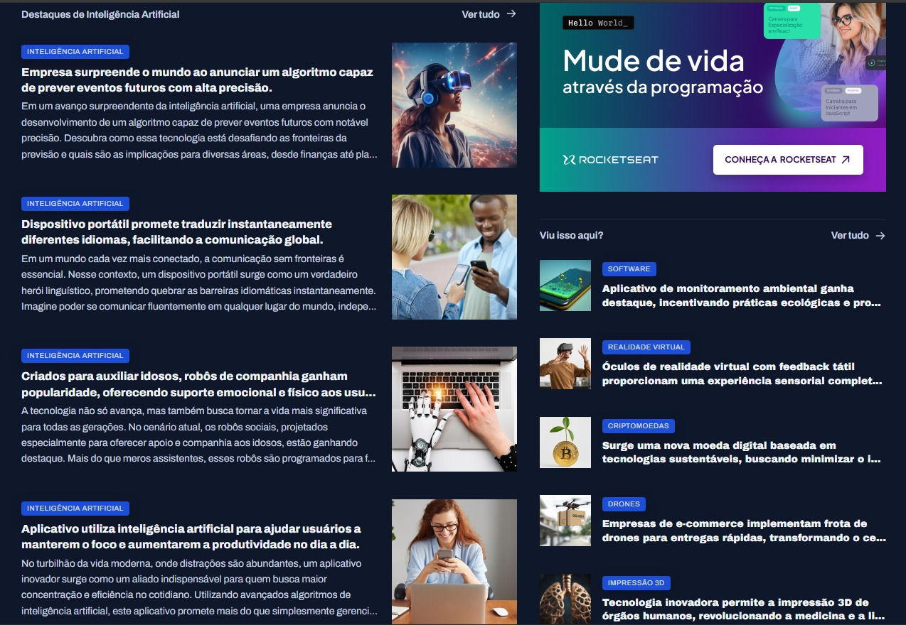

📰 Portal de Notícias
Projeto desenvolvido durante o curso Full Stack da Rocketseat, com foco na utilização do css grid.

📸 Preview

🚀 Tecnologias
HTML5 + CSS3 (Grid e Flexbox)

Figma (referência de design)

🎯 Funcionalidades
Listagem de notícias em grid

Layout responsivo

Tipografia acessível

Interface baseada no design do Figma

📄 Licença
Projeto com fins educacionais – Rocketseat Full Stack 🚀
Sinta-se livre para usar e modificar!
